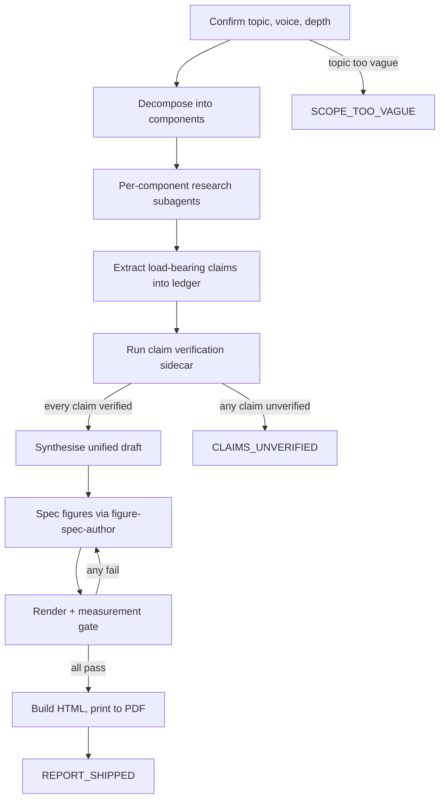

# deep-report

A Claude Code plugin that turns a research question into a claim-verified, deep-dive PDF — by spawning research agents, grounding every load-bearing fact against a fetched source, and rendering the document through a headless browser before a single byte of PDF is written.

**Status:** 0.1.0 · MIT · requires Node 20+ and Graphviz `dot`.

## Why this exists

I have been generating research reports ad hoc with single-prompt write-ups for months. The output reads beautifully and lies confidently. Once it told me the LNER runs the London-to-Cambridge line — it does not; that is Great Northern. Single-pass write-ups produce fluent prose with hallucinated specifics: wrong operator, wrong date, wrong agency name. A reader cannot tell which sentences carry weight and which were invented.

The other failure was visuals. Asking the model to "draw a diagram" produces scattered mind-map layouts with overlapping lines that re-prompting will not fix. Asking for a PDF through a Python PDF library produces output where the padding has lost the will to live.

`/deep-report` exists to refuse both. Every load-bearing claim sits in a ledger that the verifier fetches and confirms before synthesis begins. Every figure is restricted to one of four structured families — hierarchy, sequence, matrix, table — and every figure passes a deterministic measurement gate before it is inlined. The PDF is rendered from styled HTML through a headless browser. Nothing else.


## Install

```bash
/plugin marketplace add hook12aaa/deep-report
/plugin install deep-report@deep-report
```

If you don't have GraphVis Install it!

```bash
brew install graphviz
cd skills/deep-report && npm install
```

## Prerequisites

- **Node.js 20+.** Puppeteer needs it; `package.json` declares `engines.node >= 20`.
- **Graphviz `dot` on PATH.** `brew install graphviz` on macOS, `apt install graphviz` on Debian. The hierarchy renderer shells out to `dot -Tsvg`.
- **Puppeteer.** Installed via `npm install` inside `skills/deep-report/`. Bundles Chromium for Testing (~420 MB).

## Triggers

| Command | Use |
|---|---|
| `/deep-report` | The only entry point. Provide a topic, a voice anchor, and a depth mode. |

There is no auto-trigger on keyword phrases. The slash command is explicit so you do not accidentally start a half-hour pipeline on a passing remark.

## How it works

Nine stages, in order. Each emits to disk so the next stage reads the previous one's artifact, not memory.



The figure stage is the part most people skip. It works like this:

1. The spec-author subagent picks one of four families per figure, or refuses with a tagged reason. It never emits SVG, Mermaid, or DOT.
2. `scripts/render-figure.js` dispatches by family — Graphviz `dot` for hierarchies with uniform-width nodes computed from the longest label; hand-rolled SVG for sequences; CSS Grid for matrices; semantic `<table>` for tables.
3. `scripts/measure-figure.js` parses the rendered output and reports numbers — sibling-width spread, horizontal sibling-spacing spread, bounding-box overlap count, edge-endpoint snap distance, connector-length spread, no inline bolding in cells. A figure with any `pass: false` check is rejected.
4. `scripts/build-pdf.js` assembles draft markdown plus measured-passed figures plus print CSS, then prints to PDF via Puppeteer after `document.fonts.ready`.
5. `scripts/verify-pdf.js` runs post-render checks: figure-fit-content-width, WCAG AA text contrast, byte-equal determinism after metadata strip.

## Verdicts

| Verdict | Meaning |
|---|---|
| `REPORT_SHIPPED` | PDF rendered, every load-bearing claim is `verified`, every figure passed its measurement gate, the verifier returned pass. |
| `CLAIMS_UNVERIFIED` | One or more load-bearing claims failed verification after the corrective pass. No PDF is shipped. |
| `SCOPE_TOO_VAGUE` | The topic could not be narrowed into a researchable question at the confirmation step. |

No fourth verdict. No "shipped with warnings".

## Repository layout

```
.
├── .claude-plugin/
│   ├── plugin.json                    plugin manifest
│   └── marketplace.json               local marketplace stub
├── CLAUDE.md                          plugin context
├── README.md
├── LICENSE                            MIT
├── CHANGELOG.md
├── hooks/
│   ├── hooks.json                     SessionStart wiring
│   ├── session-start                  bootstrap loader (exec)
│   └── lib/emit-context.sh
├── commands/
│   └── deep-report.md                 /deep-report slash stub
├── skills/
│   ├── using-deep-report/SKILL.md     SessionStart bootstrap
│   └── deep-report/
│       ├── SKILL.md                   the authored skill
│       ├── package.json               puppeteer dependency
│       ├── schemas/
│       │   └── figure-spec.schema.json
│       ├── scripts/
│       │   ├── render-figure.js       spec → inline SVG/HTML
│       │   ├── measure-figure.js      deterministic quality gate
│       │   ├── build-pdf.js           render + measure + print
│       │   └── verify-pdf.js          post-render checks
│       ├── assets/
│       │   └── print.css              header-bold only, no cell bolding
│       ├── agents/
│       │   └── figure-spec-author.md  subagent prompt
│       └── references/                voice, depth, verifier, layouts, render
├── tests/
│   ├── run-tests.sh
│   └── hooks/test-session-start.sh
└── docs/skill-cheat/skills-in-progress/deep-report/
    ├── scope.{md,json}
    ├── design.{md,json}
    ├── design.md.sha256               immutable contract sidecar
    └── evals/                         behavioural benchmark seeds
```


## The Key principles

1. **Ground every load-bearing claim before synthesis.** Names, numbers, dates, operators, routes, percentages, identifiers — all live in the ledger, all carry a `verified` verdict before a sentence is written.
2. **Refuse scattered figure layouts.** Four families only. Mind-map, radial, scatter, free-form — out.
3. **Render PDF only through a real browser.** Python PDF libraries mishandle padding and spacing; their output is not repairable in-line.
4. **Measure, do not eyeball.** The quality gate emits numbers and tolerances. No vision-LLM "this looks fine" pass.
5. **No agent grades its own work.** The verifier sidecar runs in fresh context against fetched sources, not the research agent's memory.
6. **Header rows bold, cell text not.** Bold in body cells adds no information when most cells are short labels. Cell bold is opt-in via a single `emphasis` flag on the spec.
7. **One verdict, three values.** Reports either ship verified or do not ship.

## Troubleshooting

- **`/plugin install` says plugin not found** → `/plugin marketplace update deep-report`, then retry.
- **Skills do not appear after install** → run `/reload-plugins`; check `/plugin` Errors tab.
- **Hook does not fire** → `ls -la hooks/session-start` must show the executable bit; first line must be `#!/usr/bin/env bash`.
- **`dot: command not found`** → install Graphviz (`brew install graphviz` / `apt install graphviz`).
- **Puppeteer fails to launch Chromium** → `npx puppeteer browsers install chrome` inside `skills/deep-report/`.
- **Edits to the local plugin do not show up** → `rm -rf ~/.claude/plugins/cache/deep-report` and reinstall, or develop with `claude --plugin-dir .`.
- **A figure fails the measurement gate** → read the JSON report; the failing check names the exact tolerance and the measured number.

## Inspirations

- **OmniSVG (arXiv 2504.06263)** — documents coordinate hallucination as the dominant failure mode of LLM-generated vector graphics. Justifies the JSON-spec-only contract for the spec-author subagent. https://arxiv.org/html/2504.06263v1
- **DiagrammerGPT (COLM 2024, arXiv 2310.12128)** — the two-pass planner/renderer pattern. The planner emits a spec; deterministic code draws it. https://arxiv.org/abs/2310.12128
- **MermaidSeqBench (arXiv 2511.14967)** — six-dimension evaluator that confirms LLMs fail at Mermaid syntax often enough to put it on the renderer side, not the model side. https://arxiv.org/html/2511.14967v1

## Contributing

Open invitation. If you have a better way to enforce sibling-width uniformity, ground a claim, or print HTML to PDF deterministically, send a PR — or open an issue with the numbers that prove it. The measurement gate is deliberately replaceable; swap the rules, keep the discipline.

## Licence

MIT. Use it. Fork it. Build on it. Attribution welcome, not required.
