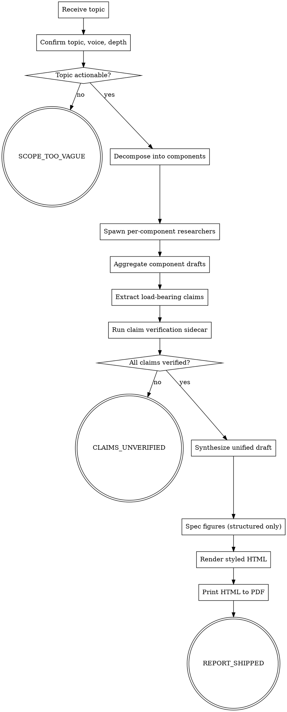

# deep-report

<!-- design-region-clean-of-hard-gates -->

<HARD-GATE>
Do NOT proceed without an explicit topic, voice anchor, and depth mode declared by the user. STOP and ask.
</HARD-GATE>

<HARD-GATE>
Do NOT enter the render stage until every load-bearing claim carries a verifier verdict. STOP and emit CLAIMS_UNVERIFIED.
</HARD-GATE>

<HARD-GATE>
Never emit a figure whose layout is scattered or free-form. STOP and re-spec the figure as a hierarchical or structured layout.
</HARD-GATE>

<HARD-GATE>
Never produce the final PDF from a path other than rendered HTML. STOP and reroute through the HTML renderer.
</HARD-GATE>

<HARD-GATE>
Do NOT emit REPORT_SHIPPED unless every extracted claim is verified. STOP and emit CLAIMS_UNVERIFIED.
</HARD-GATE>

## Anti-Pattern

**"I can write this report in one shot without verification."** Single-pass write-ups produce confident, fluent prose with hallucinated specifics, and a reader cannot tell which sentences carry weight and which were invented.

## Core Principle

Every report is a multi-agent pipeline that grounds every load-bearing claim before any prose is written.

## Process Flow



## Checklist

1. Confirm topic, voice anchor, and depth mode with the user.
2. Decompose the topic into core components.
3. Spawn one research subagent per component and collect their markdown drafts.
4. Extract every load-bearing claim into a claims ledger.
5. Run the claim verification sidecar against each claim and record verdicts.
6. Synthesize the verified component drafts into one unified document in the chosen voice and depth.
7. Spec every figure as a structured or hierarchical layout, refuse scattered layouts.
8. Render the document as styled HTML, then print to PDF.
9. Emit the verdict token.

## Step Details

### 1. Confirm topic, voice anchor, and depth mode

Ask one question at a time. Refuse to start while any of the three is unnamed.

- **Topic.** Push back on vague topics. "Tell me about AI" is too vague — ask which slice (training, evaluation, policy, a specific subfield) and which audience. If the user cannot narrow the topic into one declarative research question, emit `SCOPE_TOO_VAGUE`.
- **Voice anchor.** Default voice anchor is a calm, explainable, articulate technical lecturer. Take the user's named anchor verbatim ("write this in the voice of a working economist", "channel a textbook author"). Voice anchors that name a real public figure are allowed and useful; transcribe the named tone, do not impersonate the person.
- **Depth mode.** Two modes: `smart-brevity` (same information density, simpler language, shorter paragraphs) or `extreme-detail` (full depth, longer prose, more sub-sections). Refuse to start without one of the two named explicitly.

Read `references/voice-anchors.md` for the canonical anchor list and `references/depth-modes.md` for the side-by-side comparison.

### 2. Decompose the topic into core components

Produce a flat list of components that covers the topic without overlap. Each component must be researchable in isolation and worth one section of the final report. Aim for between four and eight components. Fewer means the topic is too narrow for a deep-dive treatment; more means the components overlap and need merging. Write the component list to `report/components.md`.

### 3. Spawn one research subagent per component

Dispatch subagents in parallel, one per component. Each subagent:

- Reads only its component brief, not the other components' briefs.
- Writes its draft to `report/research/<component-slug>.md`.
- Places an inline citation `[source: <url-or-doc>]` directly after every factual claim it makes.
- Does not write prose that is not anchored to a citation. Speculation, framing, and narration belong in the synthesizer pass, not the research pass.

Block the pipeline until every subagent has written its file.

### 4. Extract every load-bearing claim into a claims ledger

A load-bearing claim is any specific fact a reader would carry away: a name, a number, a date, an agency, a route, an operator, a percentage, an identifier, a causal link, a quoted statistic. Walk each `report/research/<component-slug>.md` and copy every load-bearing claim into `report/claims.jsonl`, one row per claim:

```
{"id": "...", "component": "...", "claim": "...", "cited_source": "...", "verdict": "pending"}
```

Generic background prose ("interest rates affect borrowing") is not load-bearing. Specific instances ("the Bank of England raised rates by 25 basis points in March 2024") is load-bearing. When in doubt, treat the claim as load-bearing.

### 5. Run the claim verification sidecar

For each row in `report/claims.jsonl`, the verifier:

1. Fetches the cited source.
2. Confirms the source contains the claim verbatim or as a close paraphrase.
3. Sets `verdict` to `verified`, `unverified` (claim not found in the cited source), or `contradicted` (source says the opposite).

Run one corrective pass: any claim with `unverified` or `contradicted` is sent back to its component subagent with the verifier note for re-research. If the corrective pass still leaves any non-`verified` claim, emit `CLAIMS_UNVERIFIED` and stop.

Read `references/verifier-protocol.md` for the canonical source-trust order and the close-paraphrase rule.

### 6. Synthesize the verified component drafts into one unified document

One synthesizer pass produces the unified document in the chosen voice and depth. The synthesizer reads:

- Every `report/research/<component-slug>.md` whose claims are all `verified`.
- `report/claims.jsonl` as the authority on what the report asserts.

The synthesizer must not introduce new facts. If the draft requires a fact that is not in the ledger, the synthesizer marks the gap with `[NEEDS-RESEARCH]` and the pipeline returns to step 3 for that component.

Output goes to `report/draft.md`.

### 7. Spec every figure as a structured layout

Before any figure is drawn, declare its layout family in the figure spec:

- **hierarchy** — a tree or org chart with a single root and uniform branching.
- **sequence** — a linear pipeline with arrows in one direction.
- **matrix** — a two-axis comparison grid.
- **table** — a labeled comparison or breakdown.

Refuse `mind-map`, `radial`, `scatter`, `free-form`, or any layout where line lengths and angles are not uniform. Scattered layouts render with overlapping lines and unreadable spacing in print, and re-prompting for a corrected version is unreliable. Write figure specs to `report/figures/<figure-id>.spec.json`.

Read `references/figure-layouts.md` for the rendered examples of each permitted family.

### 8. Render the document as styled HTML, then print to PDF

The renderer:

1. Reads `report/draft.md` plus every `report/figures/<figure-id>.spec.json`.
2. Emits a styled HTML document with print-targeted CSS.
3. Prints the HTML to PDF via a headless browser.

The PDF path never originates from a non-browser PDF generator. The output PDF lands at `report/<topic-slug>.pdf`.

Read `references/render-protocol.md` for the styling defaults, page sizing, and the headless-browser invocation contract.

### 9. Emit the verdict token

- `REPORT_SHIPPED` if the PDF rendered and every claim in `report/claims.jsonl` carries `verdict=verified`.
- `CLAIMS_UNVERIFIED` if any load-bearing claim still carries `unverified` or `contradicted` after the corrective pass.
- `SCOPE_TOO_VAGUE` if step 1 rejected the topic.

## Gate Functions

- BEFORE spawning research subagents: "Has the user named topic, voice anchor, and depth mode?"
- BEFORE accepting a figure spec: "Is this layout one of the four permitted families: hierarchy, sequence, matrix, or table?"
- BEFORE entering render: "Does every load-bearing claim resolve to a `verified` verdict?"
- BEFORE marking a claim verified: "Does the citation point to a primary source the verifier fetches, not a memorized fact?"
- BEFORE emitting REPORT_SHIPPED: "Did the PDF originate exclusively from the HTML renderer?"

## Rationalization Table

| You think... | Reality |
|---|---|
| "One short citation per section is enough" | Treat every load-bearing claim as its own ledger row. Section-level citations let specific facts drift. |
| "The model knows which rail operator runs this route" | Treat every operator, route, name, date, and number as a load-bearing claim. Memorized facts are the failure mode the verifier exists to catch. |
| "A mind-map figure will look fine if I describe it well" | Refuse the scattered layout. Re-spec as hierarchy, sequence, matrix, or table. |
| "A non-browser PDF generator is good enough for this one" | Use the HTML renderer for every PDF. Reject non-browser PDF generators outright. |
| "I can verify claims after the draft is written" | Verify against the ledger before synthesis runs. |
| "The depth mode is implicit from the topic" | Refuse to start until the user names smart-brevity or extreme-detail. Implicit depth is the source of shallow bullet output. |
| "Speculation can sit in the research draft if it's marked" | Reject speculation in the research pass. |

## Red Flags

- "Bullet points are deep enough"
- "Skip claim verification"
- "We can re-prompt for the figure if it looks bad"
- "The user did not name a depth mode, infer one"
- "This claim is common knowledge"

## Key Principles

- **Topic, voice, depth before anything else.** Refuse to start without all three.
- **Every load-bearing claim is a ledger row.** No exceptions for names, numbers, operators, or dates.
- **Structured figures only.** No scattered, radial, or free-form layouts.
- **HTML is the only path to PDF.** Non-browser PDF generators are out of scope.
- **Research cites, synthesis frames.** Speculation belongs in the synthesis pass, never in research drafts.

## The Bottom Line

```bash
#!/usr/bin/env bash
set -euo pipefail

if [[ -z "${claims_file:-}" || -z "${pdf_file:-}" || -z "${topic_actionable:-}" ]]; then
    echo "Required env: claims_file, pdf_file, topic_actionable" >&2
    exit 2
fi

if [[ "$topic_actionable" != "yes" ]]; then
    echo "VERDICT: SCOPE_TOO_VAGUE"
    exit 0
fi

if [[ ! -f "$claims_file" ]]; then
    echo "VERDICT: CLAIMS_UNVERIFIED"
    exit 1
fi

unverified=$(grep -c '"verdict": *"\(unverified\|contradicted\|pending\)"' "$claims_file" || true)
if [[ "$unverified" -gt 0 ]]; then
    echo "VERDICT: CLAIMS_UNVERIFIED"
    exit 1
fi

if [[ ! -f "$pdf_file" ]]; then
    echo "Render failed: PDF not produced from HTML renderer" >&2
    exit 3
fi

echo "VERDICT: REPORT_SHIPPED"
```
