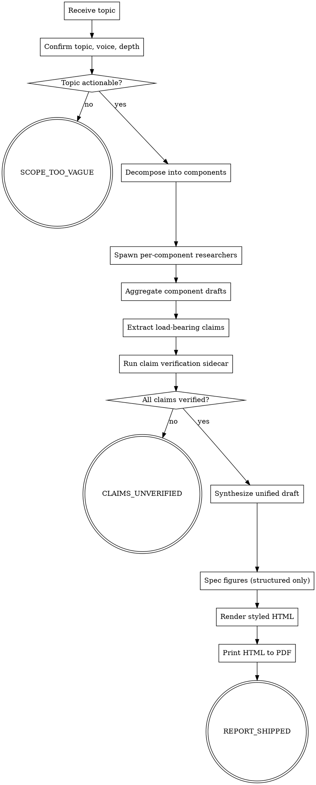

# deep-report (design)

<!-- design-region-clean-of-hard-gates -->

<HARD-GATE>
Do NOT proceed without an explicit topic, voice anchor, and depth mode declared by the user. STOP and ask.
</HARD-GATE>

<HARD-GATE>
Do NOT enter the render stage until every load-bearing claim carries a verifier verdict. STOP and emit CLAIMS_UNVERIFIED.
</HARD-GATE>

<HARD-GATE>
Never emit a figure whose layout is scattered or free-form. STOP and re-spec the figure as a hierarchical or structured layout.
</HARD-GATE>

<HARD-GATE>
Never produce the final PDF from a path other than rendered HTML. STOP and re-route through the HTML renderer.
</HARD-GATE>

<HARD-GATE>
Do NOT emit REPORT_SHIPPED unless every extracted claim is verified. STOP and emit CLAIMS_UNVERIFIED.
</HARD-GATE>

## Anti-Pattern

**"I can write this report in one shot without verification"** — single-pass write-ups produce confident, fluent prose with hallucinated specifics (e.g., naming the wrong rail operator for a route). Past ad-hoc runs failed in five recurring ways: shallow bullet-point output when no depth was named; flat voice when no anchor was named; hallucinated load-bearing claims; figures rendered as scattered layouts with overlapping lines; and PDFs produced by libraries that mishandle padding. The skill exists to refuse the single pass and force decomposition, grounded claim verification, structured figure layouts, and a separate render stage.

## Core Principle

Every report is a multi-agent pipeline that grounds every load-bearing claim before any prose is written.

## Process Flow



## Checklist

1. Confirm topic, voice anchor, and depth mode with the user.
2. Decompose the topic into core components.
3. Spawn one research subagent per component and collect their markdown drafts.
4. Extract every load-bearing claim into a claims ledger.
5. Run the claim verification sidecar against each claim and record verdicts.
6. Synthesize the verified component drafts into one unified document in the chosen voice and depth.
7. Spec every figure as a structured or hierarchical layout, refuse scattered layouts.
8. Render the document as styled HTML, then print to PDF.
9. Emit the verdict token.

## Step Details

### 1. Confirm topic, voice anchor, and depth mode

Ask one question at a time. Refuse to start while any of the three is unnamed. Default voice: Andrew Ng (explainable, articulate, calm). Depth modes: `smart-brevity` (same information, simpler language) or `extreme-detail` (full depth, longer prose).

### 2. Decompose the topic into core components

Produce a flat list of components covering the topic without overlap. Each component becomes one research subagent's beat.

### 3. Spawn per-component research subagents

One subagent per component. Each writes a markdown file to the working directory with inline citations beside every factual claim. Subagents run in parallel.

### 4. Extract load-bearing claims

Walk each component markdown. A load-bearing claim is any specific fact a reader would carry away (names, numbers, dates, operators, routes, identifiers). Write the claims ledger as one row per claim with the cited source.

### 5. Run the claim verification sidecar

For each row in the ledger, the sidecar fetches the cited source and confirms the claim appears verbatim or in close paraphrase. Claims that fail verification, contradict the source, or carry no fetchable citation are marked unverified. If any unverified claim remains after one corrective pass, emit `CLAIMS_UNVERIFIED`.

### 6. Synthesize the unified draft

One synthesizer pass produces the unified document in the chosen voice and depth. The synthesizer reads only verified component drafts and the claims ledger; it does not introduce new facts.

### 7. Spec figures as structured layouts only

For every figure, declare the layout family before drawing: hierarchy, sequence, matrix, or comparison table. Refuse scattered, free-form, or radial mind-map layouts.

### 8. Render styled HTML, then print to PDF

The renderer takes the synthesized markdown plus figure specs, produces a styled HTML document, and prints it to PDF via a headless browser. The PDF path never originates from a Python PDF library.

### 9. Emit the verdict token

`REPORT_SHIPPED` if the PDF rendered and every claim is verified. `CLAIMS_UNVERIFIED` if any load-bearing claim failed. `SCOPE_TOO_VAGUE` if the topic was rejected at step 1.

## Gate Functions

- BEFORE spawning research subagents: "Has the user named topic, voice anchor, and depth mode?"
- BEFORE accepting a figure spec: "Is this layout one of the four permitted families: hierarchy, sequence, matrix, or table?"
- BEFORE entering render: "Does every load-bearing claim resolve to a `verified` verdict?"
- BEFORE marking a claim verified: "Does the citation point to a primary source the verifier fetches, not a memorized fact?"
- BEFORE emitting REPORT_SHIPPED: "Did the PDF originate exclusively from the HTML renderer?"

## Rationalization Table

| You think... | Reality |
|---|---|
| "One short citation per section is enough" | Every load-bearing claim needs its own row in the ledger. Section-level citations let specific facts drift. |
| "The model knows which rail operator runs this route" | Memorized facts are the failure mode the verifier exists to catch. Treat every operator, route, name, or number as a load-bearing claim. |
| "A mind-map figure will look fine if I describe it well" | Scattered layouts render with overlapping lines and unreadable spacing. Re-spec as a hierarchy or table. |
| "A Python PDF library is good enough for this one" | Python PDF libraries mishandle padding and spacing. Route every PDF through the HTML renderer. |
| "I can verify claims after the draft is written" | Claims drift once they live inside prose. Verify against the ledger before synthesis, not after. |

## Red Flags

- "Bullet points are deep enough"
- "Skip claim verification — the research agents are already grounded"
- "We can re-prompt for the figure if it looks bad"
- "The Python PDF library is fine for this one"
- "Section-level citations cover it"

## Key Principles

- **Topic, voice, depth before anything else.** Refuse to start without all three.
- **Every load-bearing claim is a ledger row.** No exceptions for names, numbers, or operators.
- **Structured figures only.** No scattered or radial layouts.
- **HTML is the only path to PDF.** Python PDF libraries are out of scope.

<!-- integrity-block:start -->
## Skill Name
deep-report

## Triggers
- slash: /deep-report

## Verdict Vocabulary
- REPORT_SHIPPED
- CLAIMS_UNVERIFIED
- SCOPE_TOO_VAGUE

## HARD-GATEs
- Do NOT proceed without an explicit topic, voice anchor, and depth mode declared by the user. STOP and ask.
- Do NOT enter the render stage until every load-bearing claim carries a verifier verdict. STOP and emit CLAIMS_UNVERIFIED.
- Never emit a figure whose layout is scattered or free-form. STOP and re-spec the figure as a hierarchical or structured layout.
- Never produce the final PDF from a path other than rendered HTML. STOP and re-route through the HTML renderer.
- Do NOT emit REPORT_SHIPPED unless every extracted claim is verified. STOP and emit CLAIMS_UNVERIFIED.

## Core Principle
Every report is a multi-agent pipeline that grounds every load-bearing claim before any prose is written.

## Gate Functions
- BEFORE spawning research subagents: "Has the user named topic, voice anchor, and depth mode?"
- BEFORE accepting a figure spec: "Is this layout one of the four permitted families: hierarchy, sequence, matrix, or table?"
- BEFORE entering render: "Does every load-bearing claim resolve to a `verified` verdict?"
- BEFORE marking a claim verified: "Does the citation point to a primary source the verifier fetches, not a memorized fact?"
- BEFORE emitting REPORT_SHIPPED: "Did the PDF originate exclusively from the HTML renderer?"
<!-- integrity-block:end -->

## The Bottom Line

```bash
#!/usr/bin/env bash
set -euo pipefail
if [[ "${claims_all_verified:-no}" == "yes" && "${pdf_rendered:-no}" == "yes" ]]; then
    echo "VERDICT: REPORT_SHIPPED"
elif [[ "${topic_actionable:-yes}" == "no" ]]; then
    echo "VERDICT: SCOPE_TOO_VAGUE"
else
    echo "VERDICT: CLAIMS_UNVERIFIED"
    exit 1
fi
```

