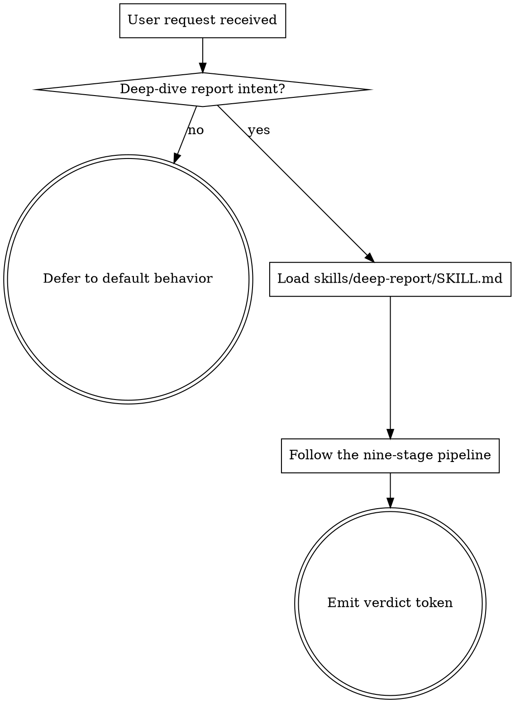

<!-- design-region-clean-of-hard-gates -->

# Using deep-report

<HARD-GATE>
Do NOT begin a deep-dive report without invoking the deep-report skill at skills/deep-report/SKILL.md. STOP and load it.
</HARD-GATE>

<HARD-GATE>
Never produce a research PDF from a single-pass write-up. STOP and route through the verified pipeline.
</HARD-GATE>

## Anti-Pattern

**"I can answer this research request inline without the full pipeline."** Inline write-ups skip claim verification and render every load-bearing fact as untrusted prose. Route every deep-dive request through the full skill.

## Core Principle

Every research PDF passes through the same nine-stage verified pipeline.

## Process Flow



## Checklist

1. Detect the deep-dive report intent from the user's prompt.
2. Load `skills/deep-report/SKILL.md` and follow it without paraphrase.
3. Emit one of the three verdict tokens at exit.

## Step Details

### 1. Detect the deep-dive report intent from the user's prompt

Trigger phrases include `/deep-report`, "write me a deep-dive report", "produce a verified research PDF", "generate a long-form report on X". Unclear prompts get one clarifying question, then load deep-report.

### 2. Load skills/deep-report/SKILL.md and follow it without paraphrase

deep-report carries the full nine-stage pipeline. Read it before acting. Refuse to summarize the pipeline back to the user as a substitute for running it.

### 3. Emit one of the three verdict tokens at exit

`REPORT_SHIPPED` when the PDF rendered and every claim carries `verdict=verified`. `CLAIMS_UNVERIFIED` when any load-bearing claim failed. `SCOPE_TOO_VAGUE` when the topic was rejected at the confirmation step.

## Gate Functions

- BEFORE answering a deep-dive request inline: "Did I load skills/deep-report/SKILL.md first?"
- BEFORE producing a PDF: "Did every load-bearing claim carry a `verified` verdict?"
- BEFORE summarizing the pipeline to the user: "Am I substituting prose for actually running the pipeline?"
- BEFORE emitting REPORT_SHIPPED: "Did the PDF originate from the HTML renderer in scripts/build-pdf.js?"

## Rationalization Table

| You think... | Reality |
|---|---|
| "This research question is short, the inline answer is enough." | Dispatch every deep-dive request through deep-report. Inline answers skip the verifier. |
| "I remember the pipeline, no need to load deep-report." | Load deep-report every time. Memory drifts; deep-report file does not. |
| "I can paraphrase the steps to save tokens." | Run deep-report steps verbatim. Paraphrase is the source of skipped stages. |

## Red Flags

- "I remember the pipeline"
- "This one is fine inline"
- "Let me sketch the answer first"
- "The user just wants a quick answer"

## Key Principles

- **Every deep-dive request routes through deep-report.** No inline write-ups.
- **Verdicts are one of three.** No improvised exit states.
- **deep-report's SKILL.md is the source of truth.** Memory is not.

## The Bottom Line

```bash
#!/usr/bin/env bash
set -euo pipefail
skill_path="${CLAUDE_PLUGIN_ROOT:-.}/skills/deep-report/SKILL.md"
if [[ ! -f "$skill_path" ]]; then
    echo "VERDICT: SCOPE_TOO_VAGUE"
    exit 1
fi
echo "loaded $skill_path"
echo "VERDICT: REPORT_SHIPPED"
```
